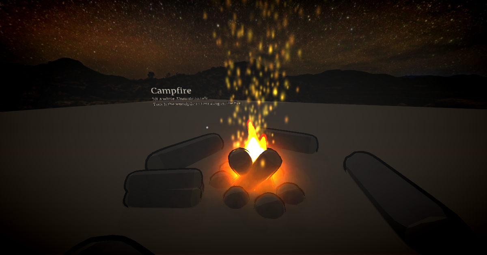

# Campfire

**[Open the world →](https://webspaces.space/showcase/campfire/)**

A fire under the Milky Way, somewhere quiet. Sit a while and talk with whoever else is here: voice is spatial,
so the people beside you sound beside you. Touch the woodpile to toss a log on, and the fire roars for everyone.

Send someone the link. That's the whole invitation.

## How it's made

- **The sky** is a real 360° photograph of a night in Namaqualand:
  `<meta name="webspace.environment.sky" content="sky.jpg">`.
- **The fire** is three flame "tongues", a glow, and two columns of embers, all Gaussian splats with
  `mix-blend-mode: plus-lighter` so their light adds up. They're generated by [`make/fire.mjs`](make/fire.mjs).
  The script flickers each flame with a little layered sine noise, driven by the clock so it's the same for everyone.
- **The stones and logs** are [`stone.svox`](stone.svox) and [`log.svox`](log.svox): Smooth Voxel models written
  by hand as a few lines of text, smoothed into shape by `deform`.
- **Tossing a log** is `webspace.state.set("log", Date.now())`; every visitor's script sees it and makes the
  fire roar for a few seconds.

## Remix ideas

- Swap `sky.jpg` for any equirectangular photo ([Poly Haven](https://polyhaven.com/hdris) has hundreds, CC0).
- Add a shared "story stone" that shows a new question for the group whenever someone touches it.
- Make it a beach bonfire: `terrain.type` to `islands`, a sunset sky, and driftwood.

## Credits

Sky: [Rogland Clear Night](https://polyhaven.com/a/rogland_clear_night) by Poly Haven, CC0. Built with the
[Webspace Engine](https://github.com/webspace-sdk/webspace-engine) (MPL-2.0), preview build
[`0.10.0-alpha.10`](https://github.com/webspace-sdk/run). Everything else here is CC0.
