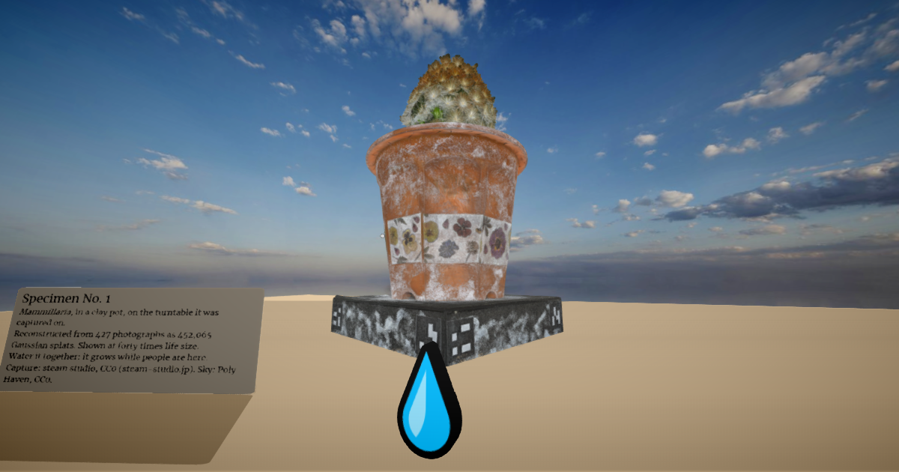

# Specimen

**[Open the world →](https://webspaces.space/showcase/specimen/)**



A small potted cactus, captured from 427 photographs as 452,065 Gaussian splats, standing forty times life
size in a desert. It turns slowly, like the turntable it was photographed on (you can still see the turntable's
markers under the pot). Touch the 💧 to water it: everyone here sees the drop fall, and it grows a little for
as long as people are around.

## A real capture, as one tag

```html
<model id="cactus1" src="cactus.spz" style="transform: scale3d(4, 4, 4)"></model>
```

That's the whole trick. The rest of [`index.html`](index.html) is a plaque (a `<label>`), a water drop (an emoji
`<div>`), a desert (a few `<meta>` tags), and a short script.

## Bring your own scan

Scan something with a phone app (Scaniverse, Polycam, Luma…) or train a 3DGS model, export `.ply` or `.spz`,
then convert and tidy it with [`make/splat2spz.mjs`](make/splat2spz.mjs) (plain Node, no dependencies):

```sh
node make/splat2spz.mjs my-scan.ply my-scan.spz --flip --center
```

- `--flip` turns y-down captures (most `.ply` training outputs) upright.
- `--center` puts the object's footprint at the origin and its base at ground level.
- `--crop-below=0.05` trims a floor or turntable; `--scale=0.5` resizes; `--max-splats=300000` keeps the most
  significant splats for faster loading.

This capture went from a 107 MB `.ply` to a 7.3 MB `.spz`. Put the `.spz` next to your `.html` and add a `<model>` tag.

## Credits

Capture: [steam studio](https://www.steam-studio.jp), released under CC0. Built with the
[Webspace Engine](https://github.com/webspace-sdk/webspace-engine) (MPL-2.0), preview build
[`0.10.0-alpha.4`](https://github.com/webspace-sdk/run).
