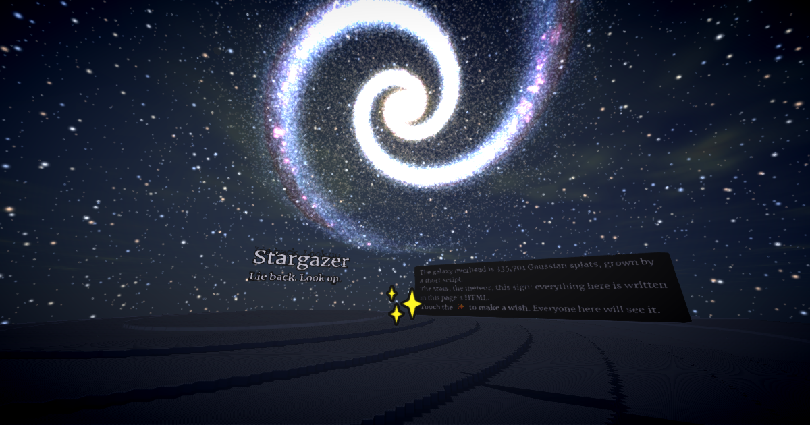

# Stargazer

**[Open the world →](https://webspaces.space/showcase/stargazer/)**



Lie on a hill under a galaxy with whoever else is here. Touch the ✨ and a shooting star crosses
everyone's sky at once.

This world is one HTML file. Open [`index.html`](index.html) and read it top to bottom: it's short.

## What's in it

| Thing | How it's made |
|---|---|
| The galaxy | `<model src="galaxy.spz" style="mix-blend-mode: plus-lighter">`: 335,701 Gaussian splats, additive, so light accumulates like starlight |
| The dust lanes | A second splat layer, `galaxy-dust.spz`, normally blended so it darkens the arms |
| The starfield | `stars.spz`: 26,000 splats on a sphere around the hill |
| The shooting star | `meteor.spz`, hidden until someone wishes |
| The night | `<meta>` tags: hills terrain, a near-black sky color, `fog` and `wrap` off so you can see 2km |
| The motion | A `<script type="module">` that sets `style.transform` (plain CSS `rotateX()`/`rotateY()`) every frame |
| The wish | `click` on the ✨ element → `webspace.state.set("wish", …)` → every visitor's script flies the same meteor |

No engine code was written for this world. It's HTML, CSS transforms, DOM events, and splat files.

## Make your own

The splats are generated by the scripts in [`make/`](make/), which have no dependencies and run with plain Node:

```sh
node make/galaxy.mjs .   # writes galaxy.spz, galaxy-dust.spz, stars.spz
node make/meteor.mjs .   # writes meteor.spz
```

Change `ARMS`, `PITCH`, the colors, or the counts and run again. `make/spz-writer.mjs` is a ~100-line
`.spz` encoder you can use to turn any procedural idea into splats: nebulae, auroras, fireflies, rain.

To host it yourself, copy this folder to any static host (GitHub Pages works) and keep
`webspace.service.js` next to `index.html`.

### Asking an AI to remix it

Point your coding agent at https://webspaces.space/llms.txt and this folder, then ask for what you want:

> "Using make/spz-writer.mjs, add an aurora: ribbons of green and violet splats hanging over the northern
> horizon that slowly ripple. Add them to index.html as another additive `<model>` and animate them in the
> world script."

## Credits

Built with the [Webspace Engine](https://github.com/webspace-sdk/webspace-engine) (MPL-2.0), preview build
[`0.10.0-alpha.2`](https://github.com/webspace-sdk/run). All assets are generated by the code in this folder
and dedicated to the public domain (CC0).
