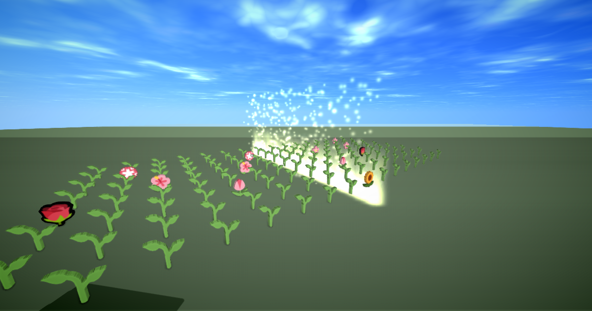

# Tone Garden

**[Open the world →](https://webspaces.space/showcase/tonegarden/)**

A garden that plays itself. Touch a bud to make it bloom; a slow curtain of light sweeps the rows and plays
whatever is blooming. Everyone in the garden sees the same flowers and hears the same song, so you compose
together, live, with whoever's there. 🍂 clears it for a fresh start.

## How it's made

It's one HTML file with a single script. There's no engine code and no server.

- **The grid** is 128 emoji objects (`
🌱
`) that the script plants with
  readable ids like `cell-5-2`. Blooming a bud just sets `el.textContent = "🌷"`.
- **Shared state**: each cell is its own `webspace.state` key, so two people planting at once never undo each
  other. Late arrivals get the whole garden when they join.
- **In sync without a server**: the light's position is computed from the clock, so everyone's sweep lines up.
- **The light** is 9,400 Gaussian splats (`sweep.spz`, made by [`make/sweep.mjs`](make/sweep.mjs)) with
  `mix-blend-mode: plus-lighter`, moved each frame with `style.transform`.
- **The sound** is WebAudio in the page: a soft plucked tone on a pentatonic scale with a little reverb. It gets
  quieter as you wander away.

The garden is grown by the script at runtime, so it's never written into the saved file. The HTML stays
exactly as you see it in [`index.html`](index.html).

## Remix ideas

- Change `NOTES` to another scale, `BLOOMS` to other emoji, or `STEP` for a different tempo.
- Add a second instrument: another grid further out with a lower octave.
- Ask an AI agent (see [llms.txt](https://webspaces.space/llms.txt)): *"Add drums as a row of mushrooms that
  thump, and make fireflies drift up whenever a chord of three or more flowers plays."*

## Credits

Built with the [Webspace Engine](https://github.com/webspace-sdk/webspace-engine) (MPL-2.0), preview build
[`0.10.0-alpha.10`](https://github.com/webspace-sdk/run). Everything here is CC0.
